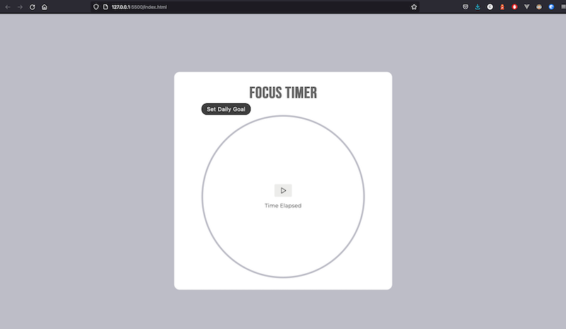

# How to use feature flags with Alpine.js (WIP 🚧)

[Read the blog post here](https://configcat.com/blog/)

This is a fictional productivity app created to demonstrate feature flags in Alpine.js. The article walks you through the steps to deploy the **Set Daily Goal** button as the new feature. With [ConfigCat's feature flag service](https://configcat.com/), this new component can be deployed by remotely switching on its feature flag without having to edit and redeploy the app.

## Build & Run

Instructions on how to build and run the application locally. A student or junior developer should be able to run the application.

### Prerequisites

- A code editor (e.g. [Visual Studio Code](https://code.visualstudio.com/))
- Basic JavaScript and [Alpine.js knowledge](https://alpinejs.dev/)

### Steps to run the app

**1.** Clone this code repository.

**2.** Open the `index.html` file in your browser.

## Learn more

Useful links to technical resources.

- [Aphine.js Documentation](https://alpinejs.dev/start-here) - learn about Alpine.js features and its API.

[**ConfigCat**](https://configcat.com) also supports many other frameworks and languages. Check out the full list of supported SDKs [here](https://configcat.com/docs/sdk-reference/overview/).

You can also explore other code samples for various languages, frameworks, and topics here in the [ConfigCat labs](https://github.com/configcat-labs) on GitHub.

Keep up with ConfigCat on [Twitter](https://twitter.com/configcat), [Facebook](https://www.facebook.com/configcat), [LinkedIn](https://www.linkedin.com/company/configcat/), and [GitHub](https://github.com/configcat).

## Author
[Chavez Harris](https://github.com/codedbychavez)

## Contributions
Contributions are welcome!
